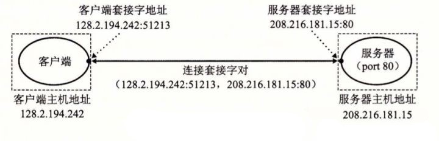

# 套接字基础

什么是套接字（对）： 一个套接字是连接的一个端点。每个套接字都有相应的由地址和16位整数端口组成的套接字地址，用“地址：端口”表示。一个连接是由它两端的套接字地址唯一确定的，这对套接字地址叫做 套接字对 ，由下列元组表示：

``
(cliaddr:cliport, servaddr:servport)  //（客户端IP地址：客户端端口，服务端IP地址：服务端端口）
``

